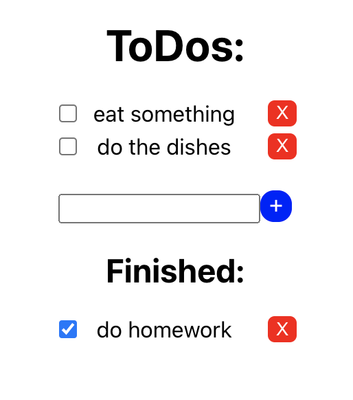

# React Einführung

## Schritt 1: Node.js und npm installieren

### Windows

1. Besuche die offizielle Node.js-Website unter [https://nodejs.org](https://nodejs.org) in deinem Webbrowser.

2. Lade das LTS (Long Term Support) Installationspaket für Windows herunter und führe es aus. Wähle während der Installation die Standardoptionen aus.

3. Öffne ein Terminal und führe die folgenden Befehle aus, um sicherzustellen, dass Node.js und npm erfolgreich installiert wurden:

```
node -v
npm -v
```

### MacOS

1. Öffne das Terminal auf deinem Mac.

2. Installiere [Homebrew](https://brew.sh/) (falls du es noch nicht hast):

```
/bin/bash -c "$(curl -fsSL https://raw.githubusercontent.com/Homebrew/install/master/install.sh)"
```

3. Installiere Node.js und npm mit Homebrew, indem du den folgenden Befehl ausführst:

```
brew install node
```

4. Überprüfe die Installation, indem du die folgenden Befehle ausführst:

```
node -v
npm -v
```

## Schritt 2: Ein neues React-Projekt erstellen

Nachdem Node.js und npm erfolgreich installiert wurden, können wir ein neues React-Projekt erstellen.

1. Öffne das Terminal.

2. Navigiere zu dem Verzeichnis, in dem du dein React-Projekt erstellen möchtest, indem du den `cd`-Befehl verwendest:

```
cd Pfad/Zum/Projektverzeichnis
```

3. Führe den folgenden Befehl aus, um ein neues React-Projekt mit [Create React App](https://reactjs.org/docs/create-a-new-react-app.html) zu erstellen:

```
npx create-react-app mein-react-projekt
```

   Ersetze `mein-react-projekt` durch den gewünschten Projektnamen.

4. Wechsle in das Projektverzeichnis:

```
cd mein-react-projekt
```

5. Starte die Entwicklungsserver:

```
npm start
```

Jetzt ist dein React-Projekt einsatzbereit, und du kannst damit beginnen, React-Komponenten zu erstellen und zu entwickeln. Öffne deinen Webbrowser und gehe zur Adresse [http://localhost:3000](http://localhost:3000), um deine React-Anwendung in Aktion zu sehen.

## Schritt 3 Entwicklung

### 1: Komponenten erstellen

In React sind Komponenten die Bausteine deiner Benutzeroberfläche. Du kannst sie verwenden, um Teile deiner App in wiederverwendbare und abgeschlossene Teile aufzuteilen. Wir werden zuerst eine einfache Komponente für unseren Zähler erstellen.

Erstelle eine neue Datei namens `Counter.js` in deinem Projektverzeichnis und füge den folgenden Code ein:

```
import React, { useState } from 'react';

function Counter() {
  const [count, setCount] = useState(0);

  function increment() {
    setCount(count + 1);
  };

  return (
    <div>
      <p>Zähler: {count}</p>
      <button onClick={increment}>Erhöhen</button>
    </div>
  );
}

export default Counter;
```

Diese Komponente enthält einen Zähler (initial auf 0 gesetzt) und einen Button, der den Zähler erhöht, wenn er gedrückt wird.

### 2: Die App-Komponente erstellen

Erstelle eine weitere Datei namens `App.js` in deinem Projektverzeichnis und füge den folgenden Code ein:

```
import React from 'react';
import Counter from './Counter';

function App() {
  return (
    <div>
      <h1>React Zähler-App</h1>
      <Counter />
    </div>
  );
}

export default App;
```

In dieser Datei importieren wir die `Counter`-Komponente, die wir zuvor erstellt haben, und verwenden sie innerhalb der `App`-Komponente. Die App-Komponente ist die Hauptkomponente unserer Anwendung.


### 3: Testen

Öffne deine App im Browser, und du solltest den Zähler und den "Erhöhen"-Button sehen. Wenn du auf den Button klickst, wird der Zähler erhöht.

### 4: Challenge

* Füge einen zweiten Knopf hinzu welcher den Zähler verringert.
* Füge einen dritten Knopf hinzu welcher den Zähler zurücksetzt.
* Wenn der Zähler negativ wird, soll er rot dargestellt werden und grün wenn er positiv ist.

### 5: Todo App
Benötigte Komponenten:
* Einzelne Aufgabe
* Liste an zu erledigenden Aufgaben
* Liste an erledigten Aufgaben
* Eingabe
* Button zum hinzufügen
* Button zum löschen
* Button zum erledigen

### Einfaches Resultat:
