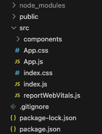

# Zweiter Teil vom React Intro

## Dateien



* index.js -> Einstieg für React in HTML -> Nicht anfassen
* reportWebVitals.js -> ignorieren
* package.json -> Übersicht über installierte packages
* node_modules -> installierte packages -> irgnorieren
* App.js -> Erste Komponente

## Html Tags
Siehe index.html

## React Komponenten
### Warum?
#### sample.html vs sample.jsx
Aufbau einer React Anwendung:
[Component-Tree](image-1.png)

### Props
``
* src
* width
* height

## React Konventionen
* Jede Komponente in eigene Datei
* Erst React Hooks > Weitere Variablen/Konstanten > Funktionen > Html
* Name einer Komponente immer groß: Feed, PriceCard
* Name der Datei gleich der Komponente: Feed.jsx, PriceCard.jsx
* Elemente einer Schleife (siehe Feed.jsx) immer mit eindeutigem key
* Zugehörige Elemente in einem Ordner
* Css von JavaScript trennen -> Feed.css, PriceCard.css

## Events
Nutzer macht irgendwas (input befüllen, klicken, etc.) -> Html Events werden ausgelöst.
```js
_reactName: "onChange",
type: "change",
target: <input type="text"></input>
```
Wert von einem Input: `event.target.value`