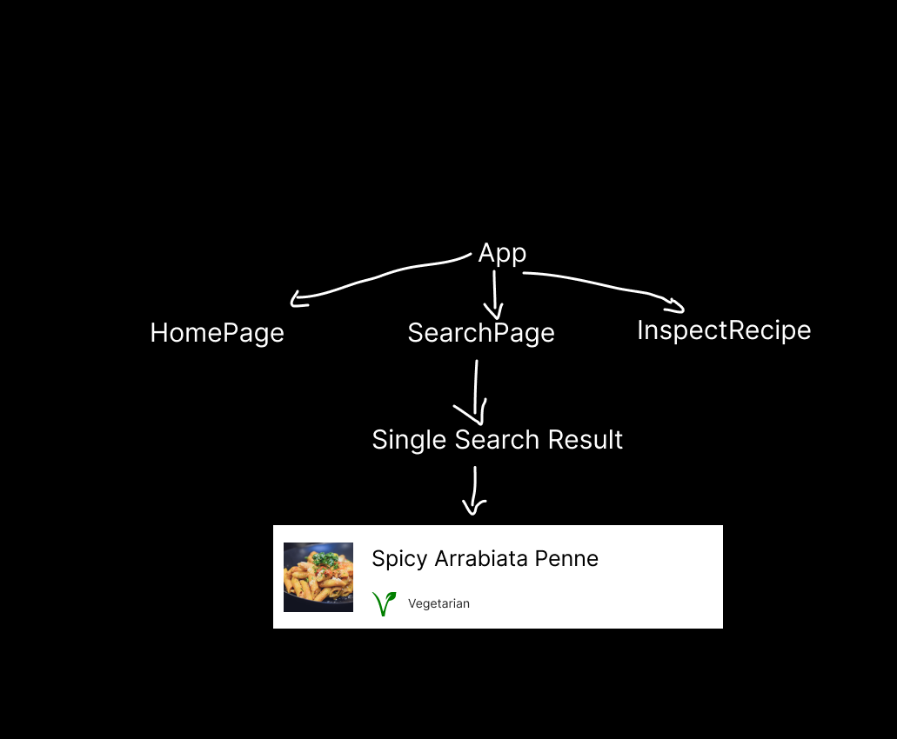

# Challenge: Rezepte App
## Wichtige Infos
### API: Woher bekommt ihr die Rezepte?
- Alle Rezepte mit dem Namen Arrabiata: www.themealdb.com/api/json/v1/1/search.php?s=Arrabiata
- Rezept mit bestimmter ID: www.themealdb.com/api/json/v1/1/lookup.php?i=52771

#### Code:
```js
//In SearchPage.jsx
const [recipes, setRecipes] = useState([]);

function getRecepiesForName(name) {
    fetch(`https://www.themealdb.com/api/json/v1/1/search.php?s=${name}`)
        .then((response) => response.json())
        .then((data) => setRecipes(data.meals));
}
```

### Userflow:
- Startseite: Zuletzte angesehene Rezepte
- Suche: Suche nach Rezepten
- Rezeptseite: Rezept mit Zutaten und Anleitung

## Verschiedene Seiten?
### React Router
- React Router ist eine Library, die uns hilft, verschiedene Seiten in React zu bauen
- Wir müssen sie installieren: `npm install react-router-dom`
- Wir müssen sie importieren: `import {BrowserRouter, Route, Switch} from "react-router-dom";`
- Wir müssen sie um unsere App wickeln:
```jsx
//in App.js
function App() {
  return (
      <BrowserRouter>
          <Routes>
              <Route path="/" element={<StartPage/>}/>
              <Route path="/search" element={<SearchPage/>}/>
              <Route path="/recipe/:id" element={<InspectRecipe/>}/>
          </Routes>
      </BrowserRouter>
  );
}
```
- Wir müssen die Links auf die verschiedenen Seiten mit `<Link>` machen:
```jsx
<Link to="/search">Suche</Link>
```
- Wir müssen die URL der Seite (beim Inspizieren eines Rezeptes) auslesen mit `useParams()`:
```jsx
const {id} = useParams();
```
## Component Tree


### Suchergebnisse speichern im Browser
#### Local Storage
- Local Storage ist ein Speicher im Browser, in dem wir Daten speichern können
- Wir können Daten im Local Storage speichern mit `localStorage.setItem("key", "value")`
- Wir können Daten aus dem Local Storage lesen mit `localStorage.getItem("key")`
- Wir können Daten aus dem Local Storage löschen mit `localStorage.removeItem("key")`

#### Code:
```jsx
//In HomePage.jsx
const [lastViewed, setLastViewed] = useState([]);

useEffect(() => {
    const lastViewedString = localStorage.getItem("lastViewed");
    if (lastViewedString) {
        setLastViewed(JSON.parse(lastViewedString));
    }
}, []);

```
```jsx
//In InspectRecipe.jsx
const [lastViewed, setLastViewed] = useState([]);
const {id} = useParams();

useEffect(() => {
    const lastViewedString = localStorage.getItem("lastViewed");
    if (lastViewedString) {
        lastViewedParsed = JSON.parse(lastViewedString);
        if (!lastViewedParsed.includes(id)) {
            setLastViewed([...lastViewedParsed, id]);
            localStorage.setItem("lastViewed", JSON.stringify([...lastViewedParsed, id]));
        }
    }
}, []);
```

